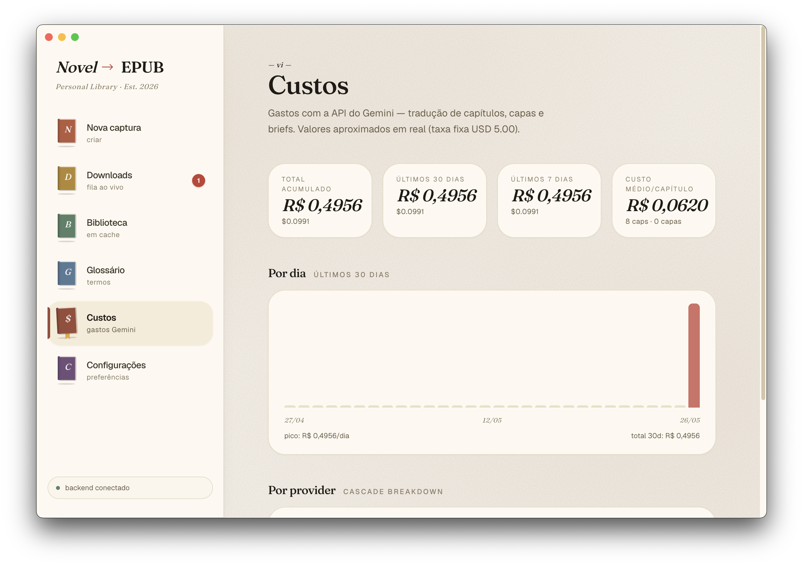

# Novel-to-EPUB

> Scraper de web novels que monta `.epub` completos — com tradução por IA,
> geração de capa, envio pro Kindle e UI desktop.

🇧🇷 Português (BR) · [🇬🇧 English](README.en.md)

Você cola a URL de uma novel, escolhe o intervalo de capítulos e o app baixa,
traduz (opcionalmente), gera capa (opcionalmente), monta o EPUB e — se quiser —
envia direto pro seu Kindle por email. Tudo roda local. Cache no SQLite garante
que nada é re-baixado.

**Stack:** Python 3.10+ (FastAPI + Typer CLI) · Electron 39 + React 19 + Tailwind 4 · SQLite

[](LICENSE)


<details>
<summary><strong>Mais telas</strong> (clique pra expandir)</summary>

| Sobre | Nova captura | Downloads |
|---|---|---|
|  |  |  |

| Glossário | Custos |
|---|---|
|  |  |

</details>

---

> ⚠️ **Aviso legal — uso pessoal.**
> Este projeto é uma ferramenta de **leitura offline**. Web novels são tipicamente
> protegidas por copyright e os sites de origem podem proibir scraping nos seus
> Termos de Uso. **Você é responsável** por: (a) respeitar o ToS de cada site,
> (b) não redistribuir os EPUBs gerados, (c) apoiar o autor original quando
> possível (Patreon, livro oficial etc). O projeto **não hospeda conteúdo** —
> só automatiza um leitor humano fazendo o que faria manualmente.

---

## Sumário

- [Aviso legal](#aviso-legal--uso-pessoal)
- [Features](#features)
- [Sites suportados](#sites-suportados)
- [Download (binários macOS)](#download-binários-macos)
- [Demo rápido](#demo-rápido)
- [Quickstart sem tradução (30s)](#quickstart-sem-tradução-30s)
- [Pré-requisitos](#pré-requisitos)
- [Instalação](#instalação)
- [Uso](#uso)
  - [Menu interativo](#menu-interativo-recomendado)
  - [CLI](#cli)
  - [App Electron](#app-electron)
  - [API REST + WebSocket](#api-rest--websocket)
- [Tradução por IA](#tradução-por-ia)
- [Como adicionar um novo site (adapter)](#como-adicionar-um-novo-site-adapter)
- [Arquitetura](#arquitetura)
- [Estrutura de pastas](#estrutura-de-pastas)
- [Variáveis de ambiente](#variáveis-de-ambiente)
- [Comandos Make](#comandos-make)
- [Limitações conhecidas](#limitações-conhecidas)
- [Contribuindo](#contribuindo)
- [Segurança](SECURITY.md)
- [Changelog](CHANGELOG.md)
- [Licença](#licença)

---

## Features

- **Multi-site** via padrão Strategy + auto-discovery — adicionar um site novo é
  criar **um arquivo** dentro de `backend/app/scraper/adapters/`.
- **Cache de capítulos** em SQLite. Re-rodar uma novel não baixa nada já visto.
- **EPUB completo**: capa, metadados (título, autor, idioma, descrição), TOC
  navegável, CSS legível, paginação por volume.
- **Tradução por IA com cascata de providers** — tenta na ordem
  `Groq → OpenRouter → Cerebras → Gemini`, com fallback automático em caso de
  rate-limit. **Glossário automático** mantém nomes próprios consistentes ao
  longo de centenas de capítulos.
- **Capa gerada por IA** (Gemini): brief visual derivado dos primeiros
  capítulos + tipografia editorial.
- **Envio para Kindle** por SMTP (Gmail, Outlook etc).
- **API REST + WebSocket** para integração ou frontends alternativos.
- **App desktop Electron** com tema cream/papel, biblioteca, editor de tradução,
  diagnóstico de cascata e estatísticas de custo.
- **CLI completa** (Typer + Rich) — útil pra desenvolver, debugar adapter novo
  ou rodar em batch.
- **Menu interativo** (`make`) — guia quem nunca viu o projeto.

---

## Sites suportados

| Site         | Domínios                                                      | Status       |
|--------------|----------------------------------------------------------------|--------------|
| NovelBin     | `novelbin.com`, `novelbin.me`, `novelbin.net`, `.org`, `.io`   | ✅ Pronto    |
| NovelMania   | `novelmania.com.br` (já em PT-BR, dispensa tradução)           | ✅ Pronto    |
| NovelFull    | `novelfull.net`                                                | ✅ Pronto (paginação concorrente) |

Não vê o seu site? Veja [Como adicionar um novo site](#como-adicionar-um-novo-site-adapter)
ou abra um [adapter request](.github/ISSUE_TEMPLATE/adapter_request.md).

---

## Download (binários macOS)

Quem não quer compilar pode baixar o `.dmg` direto da
[página de Releases](https://github.com/LucasrsRodrigues/Novel-To-Epub/releases).

> ⚠️ **Gatekeeper:** o build **não é assinado nem notarizado** (custa $99/ano da Apple).
> Na primeira execução o macOS vai dizer **"Apple não pôde verificar"**. Solução:
>
> 1. Clique com o botão direito (ou `Control` + clique) no `.app` → **Abrir**
> 2. Confirme **Abrir** no popup
> 3. A partir daí abre normal
>
> Alternativa via terminal: `xattr -dr com.apple.quarantine "/Applications/Novel to EPUB.app"`

Confira o SHA256 antes pra garantir que o `.dmg` não foi modificado em trânsito:

```bash
shasum -a 256 ~/Downloads/Novel-to-EPUB-*.dmg
# compara com o hash publicado na release
```

Linux e Windows: ainda sem binário pré-buildado, mas o app builda (veja
[Instalação](#instalação) → manual).

---

## Demo rápido

```bash
git clone https://github.com/LucasrsRodrigues/Novel-To-Epub.git
cd Novel-To-Epub
make install-all     # instala backend + frontend
make                 # abre o menu interativo
```

Sem chave de API, o app baixa e monta EPUB normalmente — a tradução é
opcional. Se quiser traduzir, configure pelo menos uma das chaves
([Variáveis de ambiente](#variáveis-de-ambiente)).

---

## Quickstart sem tradução (30s)

EPUB saindo em 3 comandos, sem nenhuma API key:

```bash
git clone https://github.com/LucasrsRodrigues/Novel-To-Epub.git
cd Novel-To-Epub
make install                              # só o backend (mais rápido que install-all)
make download URL=https://novelbin.com/b/lord-of-mysteries START=1 END=10
```

O EPUB sai em `backend/data/epubs/`. Já tem capa (raspada do site), TOC navegável,
e abre direto no Calibre / Kindle Previewer / Apple Books.

Pra interface gráfica + tradução IA + envio Kindle, veja [Instalação](#instalação) completa.

---

## Pré-requisitos

| Ferramenta | Versão mínima | Por quê |
|------------|---------------|---------|
| **Python** | 3.10 (testado em 3.14) | backend |
| **Node.js**| 18+ | frontend Electron |
| **make**   | qualquer  | atalhos (já vem no macOS/Linux; Windows: WSL) |
| **GEMINI_API_KEY** | opcional | tradução + capa por IA (free tier disponível) |
| **GROQ_API_KEY** | opcional | tradução (free tier generoso) |
| **OPENROUTER_API_KEY** / **CEREBRAS_API_KEY** | opcional | providers extras na cascata |
| **SMTP** (Gmail/Outlook) | opcional | envio pro Kindle |

Nenhuma chave de API é obrigatória pro download — só pra tradução e envio.

---

## Instalação

### macOS / Linux

```bash
git clone https://github.com/LucasrsRodrigues/Novel-To-Epub.git
cd Novel-To-Epub
make install-all     # cria .venv, pip install, npm install
```

### Windows

Use **WSL** (Ubuntu) ou rode os comandos manualmente:

```powershell
git clone https://github.com/LucasrsRodrigues/Novel-To-Epub.git
cd Novel-To-Epub

# Backend
cd backend
python -m venv .venv
.venv\Scripts\activate
pip install -r requirements.txt
cd ..

# Frontend
cd electron
npm install
cd ..
```

### Onde ficam os dados

Tudo fica em `backend/data/` (criado na primeira execução):

- `cache.sqlite3` — todos os capítulos, traduções, glossários, configs
- `epubs/` — arquivos `.epub` gerados
- `generated_covers/` — capas IA cacheadas

**Nenhum desses arquivos é versionado** (estão no `.gitignore`).

---

## Uso

### Menu interativo (recomendado)

Roda `make` sem argumentos e segue o guia:

```bash
make
```

```
╭─────────────────────────────────╮
│  epub_scrap   ·   Novel → EPUB  │
│  menu interativo                │
╰─────────────────────────────────╯

O que você quer fazer?

  1    Backend  (testar/desenvolver Python)    adapter, download, API
  2    Frontend (Electron)                     app desktop
  3    Setup   (instalar dependências)         venv + npm
  4    Limpar  (cache, builds, venv)
  0    sair
```

### CLI

Todos os comandos rodam via Makefile na raiz. A última URL digitada vira default
nas próximas perguntas — útil pra iterar.

```bash
# Listar adapters registrados
make sites

# Detectar adapter pra uma URL
make detect URL=https://novelbin.com/b/exemplo

# Baixar capítulos 1–10 em EPUB (sem capa, sem tradução)
make download URL=https://novelbin.com/b/exemplo START=1 END=10

# Mesma coisa com logs DEBUG (útil quando adapter falha)
make download URL=... START=1 END=1 LOG=DEBUG

# Traduzir UM capítulo (debug rápido, usa cache)
make translate-test URL=... CHAPTER=1 TARGET=pt-BR

# Abrir REPL Python com o app já importável
make shell
```

Ou direto pelo Python, se preferir:

```bash
cd backend
source .venv/bin/activate
python main.py --help
```

### App Electron

```bash
make dev              # modo desenvolvimento (hot-reload)
make build-electron   # build de produção
make build-mac        # empacota .dmg (macOS, arm64)
```

A primeira vez que o app abre, vai pedir as API keys em **Configurações**.

### API REST + WebSocket

```bash
make serve            # FastAPI em http://127.0.0.1:8000 (--reload em dev)
```

Endpoints principais ([`backend/app/api/routes.py`](backend/app/api/routes.py)):

| Método | Path                                            | Descrição |
|--------|-------------------------------------------------|-----------|
| GET    | `/api/health`                                   | status |
| GET    | `/api/sites`                                    | adapters registrados |
| POST   | `/api/preview-novel`                            | metadados + volumes (zero custo) |
| POST   | `/api/downloads`                                | enfileira job (scrape + tradução + capa) |
| GET    | `/api/downloads/{job_id}`                       | status do job |
| GET    | `/api/downloads/{job_id}/file`                  | baixa o EPUB |
| GET    | `/api/library`                                  | novels em cache |
| GET    | `/api/library/{novel_id}/chapters`              | lista capítulos (com `?language=pt-BR`) |
| GET    | `/api/library/{novel_id}/chapters/{idx}`        | capítulo (EN + PT) |
| PUT    | `/api/library/{novel_id}/chapters/{idx}/translation` | salva tradução manual |
| GET    | `/api/library/{novel_id}/glossary`              | nomes próprios da novel |
| POST   | `/api/volumes/{volume_id}/kindle`               | envia EPUB pro Kindle |
| POST   | `/api/volumes/{volume_id}/rebuild`              | re-monta EPUB do cache |
| POST   | `/api/volumes/{volume_id}/regenerate-cover`     | nova capa IA |
| GET    | `/api/usage/*`                                  | custos por dia/novel/provider |
| GET    | `/api/debug/translation-status`                 | pins + últimas 20 chamadas IA |
| GET/PUT| `/api/settings`                                 | config persistida no SQLite |
| WS     | `/ws/progress`                                  | progresso em tempo real |

Exemplo:

```bash
curl -X POST http://localhost:8000/api/preview-novel \
  -H 'Content-Type: application/json' \
  -d '{"url": "https://novelbin.com/b/exemplo"}'
```

---

## Tradução por IA

A tradução não usa **um** provider — usa uma **cascata**. Se um falha (rate
limit, 5xx, conteúdo bloqueado), o próximo assume sem perder o capítulo.

**Ordem default** (configurável em `Configurações` ou via API):

```
Groq → OpenRouter → Cerebras → Gemini
```

Quando um provider traduz com sucesso o **primeiro** capítulo de um volume,
ele fica **pinado** pra esse volume — evita inconsistência de estilo entre
capítulos.

O **glossário** (`backend/app/translation/glossary.py`) é populado
automaticamente a cada chamada: nomes próprios, termos de power system, lugares.
Cada entrada guarda termo original, tradução canônica, gênero (n/a, m, f),
notas e nível de confiança. Em capítulos seguintes, o glossário é injetado no
prompt — garante que "Yun Che" não vire "Yun Che" num capítulo e "Yun-che" no
outro.

**Custos** ficam visíveis em `/api/usage/*` (e na tela "Uso" da UI). Free tiers
do Groq e Cerebras geralmente cobrem novels inteiras sem custo.

---

## Como adicionar um novo site (adapter)

O registry faz auto-discovery — basta criar **um arquivo** na pasta de adapters.
Sem editar registry, sem import manual.

**1.** Crie `backend/app/scraper/adapters/seu_site.py`:

```python
from __future__ import annotations

from bs4 import BeautifulSoup

from app.models import ChapterContent, ChapterRef, NovelMeta
from app.scraper.base import BaseAdapter


class SeuSiteAdapter(BaseAdapter):
    name = "seu_site"                # id curto, único
    domains = ["seu-site.com"]       # hosts atendidos (sem protocolo)

    async def fetch_novel(self, url: str) -> NovelMeta:
        html = await self.client.get_text(url)
        soup = BeautifulSoup(html, "lxml")

        title = soup.select_one("h1.title").get_text(strip=True)
        author = soup.select_one(".author").get_text(strip=True)
        cover_url = soup.select_one(".cover img")["src"]

        chapters = [
            ChapterRef(
                index=i,
                title=a.get_text(strip=True),
                url=a["href"],
                volume_label=None,
            )
            for i, a in enumerate(soup.select(".chapter-list a"), start=1)
        ]

        return NovelMeta(
            title=title,
            source_url=url,
            slug="slug-da-novel",
            author=author,
            cover_url=cover_url,
            description="",
            chapters=chapters,
        )

    async def fetch_chapter(self, ref: ChapterRef) -> ChapterContent:
        html = await self.client.get_text(ref.url)
        soup = BeautifulSoup(html, "lxml")
        content = soup.select_one(".chapter-content")
        return ChapterContent(
            index=ref.index,
            title=ref.title,
            html=self.clean(str(content)),  # cleaner padrão; override se quiser
            url=ref.url,
        )
```

**2.** Testa:

```bash
make sites                                  # confirma que registrou
make detect URL=https://seu-site.com/novel  # confirma matching de URL
make download URL=... START=1 END=1 LOG=DEBUG
```

O contrato completo está em
[`backend/app/scraper/base.py`](backend/app/scraper/base.py). Para sites com
paginação na TOC, lidar com isso dentro de `fetch_novel()`.

---

## Arquitetura

```
┌──────────────┐  HTTP/WS   ┌────────────────────────┐
│ Electron UI  │ ─────────▶ │ FastAPI (REST + WS)    │
└──────────────┘            └───────────┬────────────┘
                                        │ enqueue
                                        ▼
                            ┌────────────────────────┐
                            │ JobManager (async)     │
                            └───────────┬────────────┘
                                        ▼
                            ┌────────────────────────┐
                            │ orchestrator           │
                            │  download_to_epub()    │
                            └───────────┬────────────┘
              ┌─────────────────────────┼─────────────────────────┐
              ▼                         ▼                         ▼
       ┌─────────────┐          ┌──────────────┐         ┌────────────────┐
       │ scraper     │          │ translation  │         │ image_gen      │
       │ (Strategy)  │          │ (cascade)    │         │ (Gemini)       │
       └──────┬──────┘          └──────┬───────┘         └────────┬───────┘
              ▼                         ▼                         ▼
       ┌─────────────────────────────────────────────────────────────────┐
       │ SQLite (cache, glossary, settings, usage, volumes, covers)      │
       └─────────────────────────────────────────────────────────────────┘
                                        │
                                        ▼
                            ┌────────────────────────┐
                            │ epub/builder           │
                            │ → .epub                │
                            └────────────────────────┘
```

**Padrões usados:**

- **Strategy** — `BaseAdapter` ([`scraper/base.py`](backend/app/scraper/base.py)):
  cada site implementa `fetch_novel()` + `fetch_chapter()`. HTTP, rate-limit,
  cache e EPUB ficam fora.
- **Registry com auto-discovery** ([`scraper/registry.py`](backend/app/scraper/registry.py)):
  `__init_subclass__` + `pkgutil.iter_modules`.
- **Provider** ([`translation/provider.py`](backend/app/translation/provider.py)):
  interface única (`GeminiProvider`, `OpenAICompatibleProvider`).
- **Cascade** ([`translation/cascade.py`](backend/app/translation/cascade.py)):
  tenta providers em ordem, com pin por volume.
- **Repository** (camada `db/`): cada store (`ChapterCache`, `GlossaryStore`,
  `SettingsStore`, etc) encapsula uma tabela.

---

## Estrutura de pastas

```
.
├── backend/                       # Python — FastAPI + Typer CLI
│   ├── main.py                    # entrypoint CLI
│   ├── requirements.txt
│   └── app/
│       ├── config.py              # settings tipadas (pydantic-settings)
│       ├── models.py              # dataclasses (NovelMeta, ChapterRef, ...)
│       ├── orchestrator.py        # download_to_epub() — orquestra tudo
│       ├── rebuild.py             # re-monta EPUB do cache (sem re-baixar)
│       ├── logging_conf.py        # structlog
│       ├── api/                   # FastAPI: routes, jobs, hub, schemas
│       ├── db/                    # SQLAlchemy: cache, glossário, settings, etc
│       ├── scraper/               # Strategy + registry
│       │   ├── base.py
│       │   ├── registry.py
│       │   ├── http.py            # cliente HTTP com rate-limit + retry
│       │   ├── cleaner.py         # limpeza padrão de HTML
│       │   └── adapters/          # NovelBin, NovelMania, NovelFull (WIP)
│       ├── epub/builder.py        # ebooklib
│       ├── image_gen/             # capa IA (Gemini)
│       ├── translation/           # cascade + glossário + style + pricing
│       └── kindle/sender.py       # SMTP async
│
├── electron/                      # Electron + React + Tailwind
│   ├── package.json
│   ├── electron-builder.yml
│   └── src/
│       ├── main/                  # processo principal (spawn do backend)
│       ├── preload/               # bridge IPC
│       └── renderer/src/
│           ├── App.tsx
│           ├── components/        # NewCapture, Library, NovelDetail,
│           │                      # Glossary, ChapterEditor, Usage, Settings...
│           ├── context/           # JobsContext (WS progress)
│           ├── lib/api.ts         # cliente HTTP
│           └── assets/
│
├── tools/menu.py                  # menu interativo (rich)
├── Makefile                       # atalhos pra tudo
├── LICENSE
└── README.md
```

---

## Variáveis de ambiente

Todas opcionais. Use env vars do shell ou um arquivo `backend/.env`.

### Backend (prefixo `NOVEL_`)

| Variável                | Default | Descrição |
|-------------------------|---------|-----------|
| `NOVEL_LOG_LEVEL`       | `INFO`  | `DEBUG`, `INFO`, `WARNING` |
| `NOVEL_LOG_JSON`        | `false` | logs em JSON (útil em servidor) |
| `NOVEL_MIN_DELAY`       | `1.0`   | delay mínimo entre requests (s) |
| `NOVEL_MAX_DELAY`       | `3.0`   | delay máximo entre requests (s) |
| `NOVEL_REQUEST_TIMEOUT` | `30`    | timeout por request (s) |
| `NOVEL_MAX_RETRIES`     | `3`     | tentativas em falhas transitórias |
| `NOVEL_DATA_DIR`        | `./data`| onde mora `cache.sqlite3` + EPUBs |

### API keys (sem prefixo)

| Variável                | Descrição |
|-------------------------|-----------|
| `GEMINI_API_KEY`        | tradução + capa IA |
| `GROQ_API_KEY`          | tradução (free tier) |
| `OPENROUTER_API_KEY`    | tradução |
| `CEREBRAS_API_KEY`      | tradução (free tier) |

Env vars têm prioridade sobre as chaves salvas via UI (que ficam no SQLite local).

---

## Comandos Make

```bash
make                 # menu interativo (default)
make help            # lista todos os alvos

# setup
make install         # backend (cria venv + pip install)
make install-electron
make install-all

# backend
make sites
make detect URL=...
make download URL=... [START=1 END=N LOG=DEBUG NO_COVER=1]
make translate-test URL=... [CHAPTER=1 TARGET=pt-BR]
make serve [HOST=127.0.0.1 PORT=8000]
make shell           # REPL Python

# frontend
make dev             # Electron hot-reload
make dev-web         # só renderer no browser
make build-electron
make build-mac       # empacota .dmg
make typecheck
make lint

# limpeza
make clean-cache     # apaga SQLite + EPUBs (irreversível)
make clean-build
make clean-venv
```

Todos os alvos aceitam variáveis pela linha:
`make download URL=... START=1 END=5 LOG=DEBUG`.

---

## Limitações conhecidas

- **Capas IA usam fonts do sistema macOS** (Georgia). Em outros SOs vai cair em fallback. TODO: embarcar TTF.
- **Sem testes automatizados ainda.** Validação é manual via `make detect` /
  `make download LOG=DEBUG`. CI checa lint + smoke imports.
- **Build do Electron pra macOS roda sem assinatura** (Gatekeeper avisa, mas
  permite). Notarização desabilitada no `electron-builder.yml`.
- **Rate-limit dos sites:** delay default `1–3s`. Se levar block, aumentar
  `NOVEL_MIN_DELAY` / `NOVEL_MAX_DELAY`.
- **Tradução não preserva 100% da formatação rica** (notas de rodapé,
  imagens inline em capítulos). Negrito/itálico são preservados.

---

## Contribuindo

PRs e issues bem-vindos! Sugestões boas pra começar:

- **Novo adapter de site** — a contribuição mais valiosa
  ([tutorial](#como-adicionar-um-novo-site-adapter) ·
  [adapter request](.github/ISSUE_TEMPLATE/adapter_request.md))
- **Embarcar TTFs** na geração de capa pra cross-platform real
- **Adicionar testes** pros adapters (suite de fixtures HTML)
- **Traduções da UI** pra inglês/espanhol
- **README.en.md** — qualquer melhoria é bem-vinda

📋 **Detalhes**: [CONTRIBUTING.md](CONTRIBUTING.md) — setup, critérios de aceite,
release process pra mantenedores.

🔒 **Segurança**: encontrou vulnerabilidade? Veja [SECURITY.md](SECURITY.md).

📝 **Mudanças**: [CHANGELOG.md](CHANGELOG.md).

---

## Licença

[MIT](LICENSE) © 2026 Lucas Rodrigues

Este projeto usa bibliotecas de terceiros — ver `backend/requirements.txt` e
`electron/package.json` pras licenças individuais. Notáveis: **ebooklib**
(AGPL-3.0), **FastAPI** (MIT), **Electron** (MIT), **React** (MIT).

---

## Agradecimentos

- [**ebooklib**](https://github.com/aerkalov/ebooklib) — geração de EPUB.
- [**electron-vite**](https://electron-vite.org) — template Electron + Vite.
- **Groq, Cerebras, OpenRouter, Google AI Studio** — pelos free tiers que
  viabilizam o uso sem custo pra novels inteiras.
